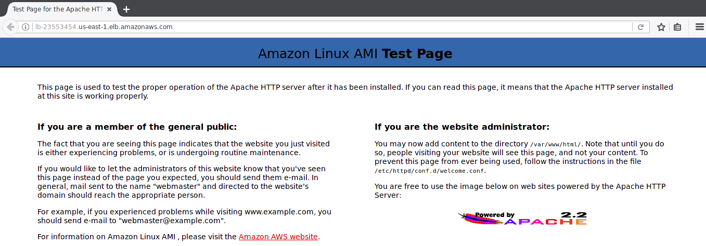
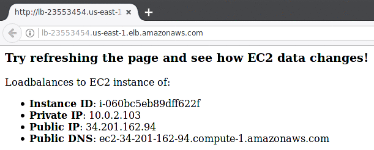

## Visualize aws load balancing

This tiny init script helps you visualize & troubleshoot aws load balancing while you learn the platform.

### Why should I care?

If you simply install httpd and try to load balance a few servers, you get the following result:

which doesn't tell you anything about load balancing. You could have run a single EC2 instance and you would have gotten the very same result. Really confusing, isn't it? This is why I created this init script.

### Demo

After every refresh, you get information about the underlying EC2 instance:

